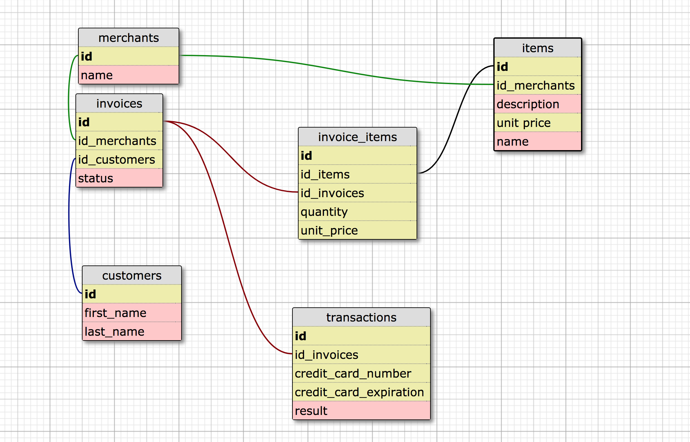

# Rails Engine

## Summary
Rails Engine is an API for managing, searching and analyzing business statistics.

## Setup (Mac OS)
Run the following commands in your terminal to get up and running:
* Clone the repo onto your machine:
```$ git clone https://github.com/andymond/rails_engine.git ```
* CD into the folder
```$ cd rails_engine ```
* Install dependencies
``` $ bundle install ```
* Create your postgres database & tables:
```$ rails db:setup ```
* Seed your database with the included data files:
```$ rake import_csv:all ```
* To run the included test suite run:
```$ rspec ```

## Stack
* Rails 5.1.5
* Ruby 2.4.1
* PostgreSQL 10.1
* RSpec 3.7

## DB Schema


